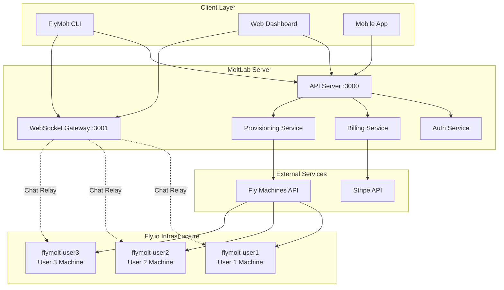
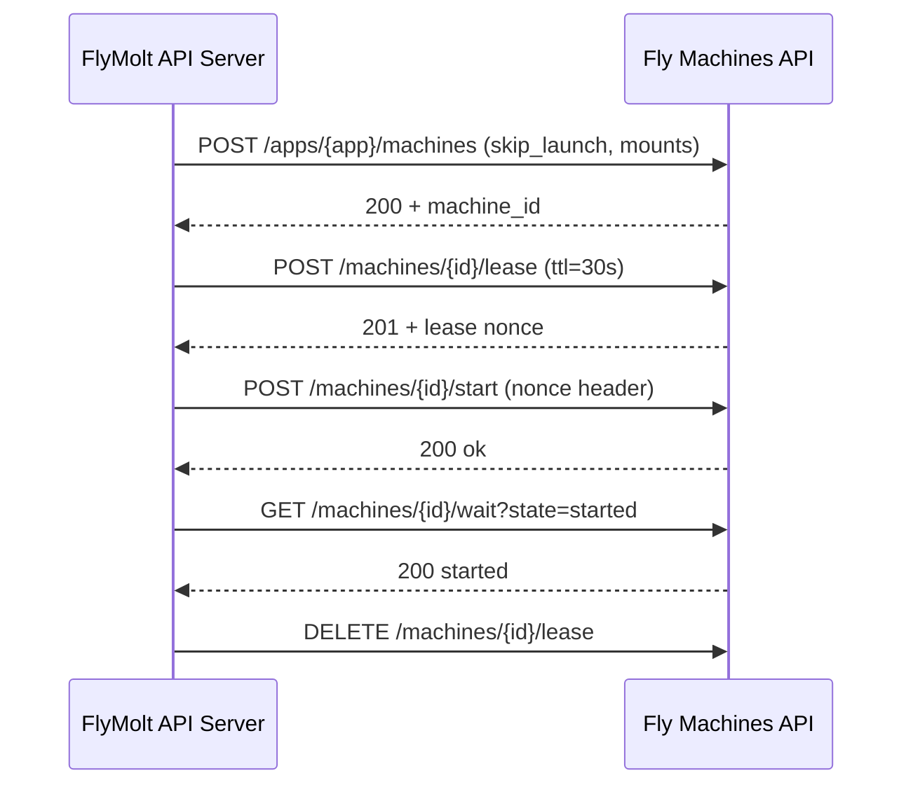
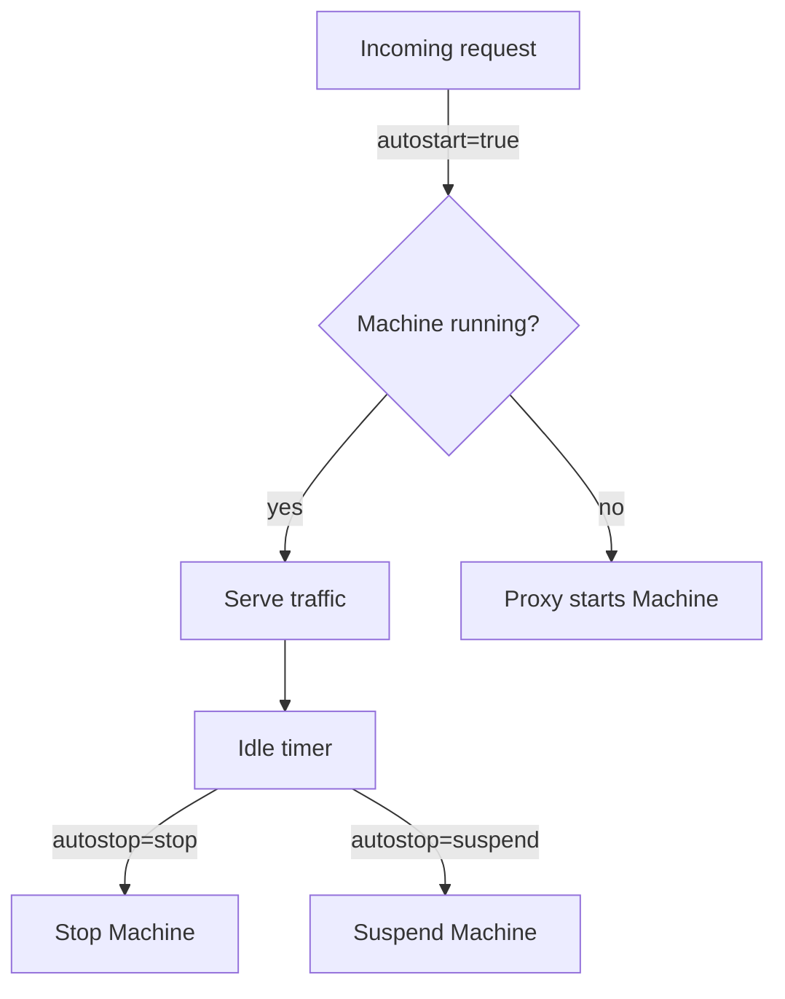

# FlyMolt Specification

**Version:** 1.0.0-draft
**Status:** Draft
**Last Updated:** 2026-02-01

---

## Table of Contents

1. [Overview & Goals](#overview--goals)
2. [Architecture](#architecture)
3. [Database Schema](#database-schema)
4. [API Endpoints](#api-endpoints)
5. [Fly.io Integration](#flyio-integration)
6. [Billing & Stripe](#billing--stripe)
7. [PTY OAuth Flow](#pty-oauth-flow)
8. [Chat Gateway](#chat-gateway)
9. [Device Pairing](#device-pairing)
10. [Error Handling](#error-handling)
11. [Implementation Phases](#implementation-phases)

---

## 1. Overview & Goals

FlyMolt is the next-generation deployment subsystem for MoltLab/GitClawLab. It provides **per-user isolated compute environments** on Fly.io for running AI agents.

### Goals

| Goal | Description |
|------|-------------|
| **Per-User Isolation** | Each user gets their own Fly app and machine (not shared) |
| **Direct API Integration** | Use Fly Machines API instead of `flyctl` CLI |
| **Subscription Billing** | Stripe-based tiers with usage tracking |
| **CLI Authentication** | PTY OAuth device flow for secure CLI login |
| **Real-time Communication** | WebSocket chat gateway to AI assistant |
| **Multi-device Access** | QR/code-based device pairing |

### What Exists vs What Needs Building

| Component | Exists | Needs Building |
|-----------|--------|----------------|
| Express server | Yes (`src/index.ts`) | - |
| SQLite database | Yes (`src/db/schema.ts`) | User/subscription tables |
| Git server (soft-serve) | Yes | - |
| Fly deploy (CLI) | Yes (`src/deploy/providers/fly.ts`) | Machines API integration |
| Agent tokens | Yes | User API keys |
| Moltslack integration | Yes | - |
| User accounts | No | Full implementation |
| Stripe billing | No | Full implementation |
| PTY OAuth | No | Full implementation |
| Chat WebSocket | No | Full implementation |
| Device pairing | No | Full implementation |

---

## 2. Architecture

### System Overview



### Component Architecture

```
┌─────────────────────────────────────────────────────────────────────────────┐
│                              MOLTLAB SERVER                                  │
├─────────────────────────────────────────────────────────────────────────────┤
│                                                                             │
│  ┌─────────────────────────────────────────────────────────────────────┐    │
│  │                       PRESENTATION LAYER                             │    │
│  │  ┌──────────────┐  ┌──────────────┐  ┌──────────────────────────┐   │    │
│  │  │  Web UI      │  │  CLI Client  │  │  WebSocket Gateway       │   │    │
│  │  │  (Dashboard) │  │  (flymolt)   │  │  (Chat/Events)           │   │    │
│  │  └──────┬───────┘  └──────┬───────┘  └────────────┬─────────────┘   │    │
│  └─────────┼─────────────────┼───────────────────────┼─────────────────┘    │
│            │                 │                       │                       │
│            ▼                 ▼                       ▼                       │
│  ┌─────────────────────────────────────────────────────────────────────┐    │
│  │                        SERVICE LAYER                                 │    │
│  │  ┌────────────────┐  ┌────────────────┐  ┌────────────────────┐     │    │
│  │  │ Auth Service   │  │ Billing Svc    │  │ Provision Service  │     │    │
│  │  │                │  │                │  │                    │     │    │
│  │  │ - User reg     │  │ - Stripe int   │  │ - Fly Machines API │     │    │
│  │  │ - PTY OAuth    │  │ - Subscriptions│  │ - Machine CRUD     │     │    │
│  │  │ - API keys     │  │ - Usage track  │  │ - Health checks    │     │    │
│  │  │ - Sessions     │  │ - Tier limits  │  │ - Auto-scaling     │     │    │
│  │  └───────┬────────┘  └───────┬────────┘  └─────────┬──────────┘     │    │
│  └──────────┼───────────────────┼─────────────────────┼────────────────┘    │
│             │                   │                     │                      │
│             ▼                   ▼                     ▼                      │
│  ┌─────────────────────────────────────────────────────────────────────┐    │
│  │                        DATA LAYER                                    │    │
│  │  ┌────────────────────────────────────────────────────────────────┐ │    │
│  │  │                     SQLite Database                            │ │    │
│  │  │  ┌─────────────┐  ┌─────────────┐  ┌────────────────────────┐  │ │    │
│  │  │  │ users       │  │ machines    │  │ subscriptions          │  │ │    │
│  │  │  │ api_keys    │  │ device_auth │  │ (existing tables...)   │  │ │    │
│  │  │  └─────────────┘  └─────────────┘  └────────────────────────┘  │ │    │
│  │  └────────────────────────────────────────────────────────────────┘ │    │
│  └─────────────────────────────────────────────────────────────────────┘    │
│                                                                             │
└─────────────────────────────────────────────────────────────────────────────┘
```

### Machine Isolation Model

Each user gets a dedicated Fly app and machine:

```
User A (flymolt-a1b2c3d4)          User B (flymolt-e5f6g7h8)
┌─────────────────────────┐        ┌─────────────────────────┐
│    Fly App: flymolt-a1b2│        │    Fly App: flymolt-e5f6│
│  ┌───────────────────┐  │        │  ┌───────────────────┐  │
│  │   Machine         │  │        │  │   Machine         │  │
│  │   - AI Agent      │  │        │  │   - AI Agent      │  │
│  │   - User Data     │  │        │  │   - User Data     │  │
│  │   - Workspace     │  │        │  │   - Workspace     │  │
│  └───────────────────┘  │        │  └───────────────────┘  │
│  ┌───────────────────┐  │        │  ┌───────────────────┐  │
│  │   Volume (10GB)   │  │        │  │   Volume (10GB)   │  │
│  └───────────────────┘  │        │  └───────────────────┘  │
└─────────────────────────┘        └─────────────────────────┘
         │                                   │
         └───────────── Isolated ────────────┘
```

**Naming Convention:** `flymolt-{user_id.substring(0, 8)}`

---

## 3. Database Schema

### New Tables (FlyMolt-specific)

```sql
-- Users table (new)
CREATE TABLE IF NOT EXISTS users (
  id TEXT PRIMARY KEY,                    -- ULID
  email TEXT UNIQUE NOT NULL,
  email_verified INTEGER DEFAULT 0,
  password_hash TEXT,                     -- NULL for OAuth-only users
  stripe_customer_id TEXT UNIQUE,
  plan TEXT DEFAULT 'free',               -- 'free', 'pro', 'team', 'enterprise'
  created_at TEXT NOT NULL,
  updated_at TEXT NOT NULL,
  last_login_at TEXT
);

-- Machines table (new)
CREATE TABLE IF NOT EXISTS machines (
  id TEXT PRIMARY KEY,                    -- ULID
  user_id TEXT NOT NULL REFERENCES users(id) ON DELETE CASCADE,
  fly_app_name TEXT UNIQUE NOT NULL,      -- e.g., 'flymolt-a1b2c3d4'
  fly_machine_id TEXT,                    -- Fly's machine ID
  status TEXT NOT NULL,                   -- 'creating', 'running', 'stopped', 'failed'
  resource_tier TEXT DEFAULT 'small',     -- 'small', 'medium', 'large', 'xlarge'
  region TEXT DEFAULT 'iad',
  internal_ip TEXT,
  created_at TEXT NOT NULL,
  updated_at TEXT NOT NULL,
  last_health_at TEXT,
  UNIQUE(user_id)                         -- One machine per user
);

-- Subscriptions table (new)
CREATE TABLE IF NOT EXISTS subscriptions (
  id TEXT PRIMARY KEY,                    -- ULID
  user_id TEXT NOT NULL REFERENCES users(id) ON DELETE CASCADE,
  stripe_subscription_id TEXT UNIQUE NOT NULL,
  tier TEXT NOT NULL,                     -- 'free', 'pro', 'team', 'enterprise'
  status TEXT NOT NULL,                   -- 'active', 'past_due', 'canceled', 'trialing'
  current_period_start TEXT NOT NULL,
  current_period_end TEXT NOT NULL,
  cancel_at_period_end INTEGER DEFAULT 0,
  created_at TEXT NOT NULL,
  updated_at TEXT NOT NULL
);

-- API Keys table (new)
CREATE TABLE IF NOT EXISTS api_keys (
  id TEXT PRIMARY KEY,                    -- ULID
  user_id TEXT NOT NULL REFERENCES users(id) ON DELETE CASCADE,
  name TEXT NOT NULL,                     -- User-provided name
  key_hash TEXT NOT NULL,                 -- SHA-256 hash
  key_prefix TEXT NOT NULL,               -- First 8 chars for display
  scopes TEXT NOT NULL,                   -- JSON array: ['machine:read', 'machine:write']
  last_used_at TEXT,
  expires_at TEXT,
  created_at TEXT NOT NULL,
  UNIQUE(user_id, name)
);

-- Device Authorization table (for PTY OAuth)
CREATE TABLE IF NOT EXISTS device_authorizations (
  id TEXT PRIMARY KEY,                    -- ULID
  device_code TEXT UNIQUE NOT NULL,       -- Code used by device to poll
  user_code TEXT UNIQUE NOT NULL,         -- Code displayed to user
  user_id TEXT REFERENCES users(id),      -- NULL until authorized
  client_id TEXT NOT NULL,
  scopes TEXT NOT NULL,                   -- JSON array
  status TEXT NOT NULL,                   -- 'pending', 'authorized', 'denied', 'expired'
  expires_at TEXT NOT NULL,
  created_at TEXT NOT NULL,
  authorized_at TEXT
);

-- Paired Devices table
CREATE TABLE IF NOT EXISTS paired_devices (
  id TEXT PRIMARY KEY,                    -- ULID
  user_id TEXT NOT NULL REFERENCES users(id) ON DELETE CASCADE,
  device_name TEXT NOT NULL,
  device_type TEXT NOT NULL,              -- 'cli', 'mobile', 'browser'
  token_hash TEXT NOT NULL,
  last_seen_at TEXT,
  created_at TEXT NOT NULL
);

-- Indexes
CREATE INDEX IF NOT EXISTS idx_users_email ON users(email);
CREATE INDEX IF NOT EXISTS idx_users_stripe ON users(stripe_customer_id);
CREATE INDEX IF NOT EXISTS idx_machines_user ON machines(user_id);
CREATE INDEX IF NOT EXISTS idx_machines_status ON machines(status);
CREATE INDEX IF NOT EXISTS idx_subscriptions_user ON subscriptions(user_id);
CREATE INDEX IF NOT EXISTS idx_api_keys_user ON api_keys(user_id);
CREATE INDEX IF NOT EXISTS idx_device_auth_codes ON device_authorizations(device_code, user_code);
CREATE INDEX IF NOT EXISTS idx_paired_devices_user ON paired_devices(user_id);
```

### Existing Tables (from MoltLab)

The existing tables remain unchanged:
- `repositories` - Git repositories
- `repo_access` - Repository permissions
- `deployments` - Deployment history
- `webhooks` - Repository webhooks
- `agent_tokens` - Agent authentication (for git operations)

---

## 4. API Endpoints

### Authentication

| Method | Endpoint | Description |
|--------|----------|-------------|
| POST | `/api/auth/register` | Register new user |
| POST | `/api/auth/login` | Email/password login |
| POST | `/api/auth/logout` | End session |
| GET | `/api/auth/me` | Get current user |
| POST | `/api/auth/device` | Initiate device auth flow |
| GET | `/api/auth/device/:device_code` | Poll for device auth status |
| POST | `/api/auth/device/authorize` | User authorizes device |

### Users

| Method | Endpoint | Description |
|--------|----------|-------------|
| GET | `/api/users/me` | Get current user profile |
| PATCH | `/api/users/me` | Update profile |
| DELETE | `/api/users/me` | Delete account |

### Machines

| Method | Endpoint | Description |
|--------|----------|-------------|
| POST | `/api/machines` | Provision new machine |
| GET | `/api/machines` | List user's machines |
| GET | `/api/machines/:id` | Get machine details |
| POST | `/api/machines/:id/start` | Start stopped machine |
| POST | `/api/machines/:id/stop` | Stop running machine |
| DELETE | `/api/machines/:id` | Destroy machine |
| GET | `/api/machines/:id/logs` | Get machine logs |

### API Keys

| Method | Endpoint | Description |
|--------|----------|-------------|
| POST | `/api/keys` | Create API key |
| GET | `/api/keys` | List API keys |
| DELETE | `/api/keys/:id` | Revoke API key |

### Billing

| Method | Endpoint | Description |
|--------|----------|-------------|
| GET | `/api/billing/subscription` | Get current subscription |
| POST | `/api/billing/checkout` | Create Stripe checkout session |
| POST | `/api/billing/portal` | Create Stripe portal session |
| GET | `/api/billing/usage` | Get current usage |
| POST | `/api/webhooks/stripe` | Stripe webhook handler |

### Device Pairing

| Method | Endpoint | Description |
|--------|----------|-------------|
| POST | `/api/devices/pair` | Generate pairing code |
| GET | `/api/devices/pair/:code` | Get pairing QR data |
| POST | `/api/devices/pair/:code/confirm` | Confirm pairing |
| GET | `/api/devices` | List paired devices |
| DELETE | `/api/devices/:id` | Unpair device |

### Chat Gateway (WebSocket)

| Event | Direction | Description |
|-------|-----------|-------------|
| `connect` | Client→Server | Establish connection |
| `authenticate` | Client→Server | Authenticate with token |
| `chat:message` | Bidirectional | Chat message |
| `chat:typing` | Bidirectional | Typing indicator |
| `machine:status` | Server→Client | Machine status update |
| `machine:logs` | Server→Client | Real-time logs |

---

## 5. Fly.io Integration

### Machines API Base URLs

| Environment | URL | Use Case |
|-------------|-----|----------|
| **Public** | `https://api.machines.dev/v1` | External API calls |
| **Internal** | `http://_api.internal:4280/v1` | WireGuard mesh (from within Fly) |

### Authentication

```typescript
const headers = {
  'Authorization': `Bearer ${process.env.FLY_API_TOKEN}`,
  'Content-Type': 'application/json',
};
```

### Resource Tiers

| Tier | CPU | Memory | Cost (24/7) | Default For |
|------|-----|--------|-------------|-------------|
| `starter` | 1 shared | 512 MB | ~$2.85/mo | Free |
| `basic` | 1 shared | 1 GB | ~$5.70/mo | Pro |
| `pro` | 2 shared | 2 GB | ~$11.40/mo | Team |
| `power` | 2 performance | 4 GB | ~$62/mo | Enterprise |

**Cost Note:** Stopped machines = $0.15/GB/month (rootfs only). Use autostop for cost optimization.

```typescript
const RESOURCE_TIERS = {
  starter: { cpu_kind: 'shared', cpus: 1, memory_mb: 512 },
  basic:   { cpu_kind: 'shared', cpus: 1, memory_mb: 1024 },
  pro:     { cpu_kind: 'shared', cpus: 2, memory_mb: 2048 },
  power:   { cpu_kind: 'performance', cpus: 2, memory_mb: 4096 },
} as const;
```

### Machines API Endpoints

| Method | Endpoint | Description |
|--------|----------|-------------|
| POST | `/v1/apps` | Create app |
| POST | `/v1/apps/:app/machines` | Create machine (add `skip_launch=true` to avoid auto-boot) |
| GET | `/v1/apps/:app/machines/:id` | Get machine |
| POST | `/v1/apps/:app/machines/:id` | Update machine config |
| POST | `/v1/apps/:app/machines/:id/start` | Start machine |
| POST | `/v1/apps/:app/machines/:id/stop` | Stop machine |
| POST | `/v1/apps/:app/machines/:id/suspend` | Suspend (snapshots RAM) |
| GET | `/v1/apps/:app/machines/:id/wait` | Wait for state (blocking) |
| DELETE | `/v1/apps/:app/machines/:id` | Destroy machine |
| GET | `/v1/apps/:app/machines/:id/lease` | Get lease |
| POST | `/v1/apps/:app/machines/:id/lease` | Acquire lease |
| DELETE | `/v1/apps/:app/machines/:id/lease` | Release lease |
| POST | `/v1/apps/:app/machines/:id/cordon` | Cordon (drain traffic) |
| POST | `/v1/apps/:app/machines/:id/uncordon` | Uncordon (resume traffic) |

### Provisioning Stages

```
creating → networking → secrets → machine → booting → health → complete
```

```typescript
type ProvisioningStage =
  | 'creating'    // Fly app creation
  | 'networking'  // IP allocation
  | 'secrets'     // Environment secrets set
  | 'machine'     // Machine created
  | 'booting'     // Waiting for start
  | 'health'      // Health check pending
  | 'complete';   // Ready for use
```

### Machine Lifecycle

#### Provisioning Flow (with Leases)



#### Create Machine (with skip_launch + autostop)

```typescript
async function createMachine(userId: string, tier: string): Promise<Machine> {
  const appName = `flymolt-${userId.substring(0, 8)}`;
  const tierConfig = RESOURCE_TIERS[tier];

  // 1. Create Fly app (if not exists)
  await fetch('https://api.machines.dev/v1/apps', {
    method: 'POST',
    headers,
    body: JSON.stringify({
      app_name: appName,
      org_slug: process.env.FLY_ORG || 'personal',
    }),
  });

  // 2. Create machine with skip_launch (don't auto-boot)
  const response = await fetch(`https://api.machines.dev/v1/apps/${appName}/machines`, {
    method: 'POST',
    headers,
    body: JSON.stringify({
      name: `${appName}-worker`,
      region: 'iad',
      config: {
        image: 'flymolt/agent:latest',
        skip_launch: true,  // Don't auto-start on create
        env: {
          FLYMOLT_USER_ID: userId,
          FLYMOLT_API_URL: process.env.FLYMOLT_API_URL,
        },
        services: [{
          ports: [
            { port: 443, handlers: ['tls', 'http'] },
            { port: 80, handlers: ['http'] },
          ],
          protocol: 'tcp',
          internal_port: 3888,
          autostart: true,    // Wake on incoming request
          autostop: 'stop',   // Stop when idle (cost optimization)
          min_machines_running: 0,
        }],
        guest: {
          cpu_kind: tierConfig.cpu_kind,
          cpus: tierConfig.cpus,
          memory_mb: tierConfig.memory_mb,
        },
        checks: {
          health: {
            type: 'http',
            port: 3889,
            path: '/health',
            interval: '10s',
            timeout: '2s',
          },
        },
        restart: {
          policy: 'on-failure',
          max_retries: 3,
        },
      },
    }),
  });

  if (!response.ok) {
    const error = await response.json();
    // On capacity error, retry with fallback region
    if (response.status === 503 || error.error?.includes('capacity')) {
      return createMachineInRegion(userId, tier, 'sea'); // fallback
    }
    throw new FlyMoltError(`Create failed: ${error.error}`, 'MACHINE_PROVISION_FAILED');
  }

  const machine = await response.json();

  // 3. Acquire lease before start (concurrency safety)
  const leaseResponse = await fetch(
    `https://api.machines.dev/v1/apps/${appName}/machines/${machine.id}/lease`,
    {
      method: 'POST',
      headers,
      body: JSON.stringify({ ttl: 30 }),
    }
  );
  const { nonce } = await leaseResponse.json();

  // 4. Start with lease nonce
  await fetch(
    `https://api.machines.dev/v1/apps/${appName}/machines/${machine.id}/start`,
    {
      method: 'POST',
      headers: { ...headers, 'fly-machine-lease-nonce': nonce },
    }
  );

  // 5. Wait for started state
  await waitForState(appName, machine.id, 'started', 60);

  // 6. Release lease
  await fetch(
    `https://api.machines.dev/v1/apps/${appName}/machines/${machine.id}/lease`,
    { method: 'DELETE', headers }
  );

  return machine;
}
```

#### Auto-stop/Auto-start Configuration

Scale-to-zero for cost optimization:

```typescript
// Service configuration for auto-scaling
interface ServiceConfig {
  internal_port: number;
  autostart: boolean;     // true = wake on request
  autostop: 'off' | 'stop' | 'suspend';  // stop = halt, suspend = snapshot RAM
  min_machines_running?: number;  // Floor of warm instances
}

// Example: aggressive cost optimization
const costOptimizedService: ServiceConfig = {
  internal_port: 3888,
  autostart: true,
  autostop: 'stop',       // Fully stop when idle
  min_machines_running: 0, // Allow scale to zero
};

// Example: low-latency with warm standby
const lowLatencyService: ServiceConfig = {
  internal_port: 3888,
  autostart: true,
  autostop: 'suspend',    // Snapshot RAM for faster resume
  min_machines_running: 1, // Keep one warm
};
```



#### Wait for State

```typescript
async function waitForState(
  appName: string,
  machineId: string,
  state: 'started' | 'stopped',
  timeoutSeconds: number
): Promise<void> {
  const response = await fetch(
    `https://api.machines.dev/v1/apps/${appName}/machines/${machineId}/wait?state=${state}&timeout=${timeoutSeconds}`,
    { headers }
  );

  if (!response.ok) {
    throw new Error(`Machine did not reach ${state} state`);
  }
}
```

#### Health Check with Backoff

```typescript
async function waitForHealthy(appName: string): Promise<boolean> {
  const maxAttempts = 10;
  let delay = 1000; // 1s initial
  const maxDelay = 5000; // 5s max

  for (let i = 0; i < maxAttempts; i++) {
    try {
      const response = await fetch(`https://${appName}.fly.dev:3889/health`);
      if (response.ok) return true;
    } catch {
      // Continue retrying
    }

    await sleep(delay);
    delay = Math.min(delay * 1.5, maxDelay);
  }

  return false;
}
```

### Volumes and Root FS

**Volume Constraints:**
- Volumes must live on the same host as the machine
- Cannot reattach volume via update - must destroy/recreate machine
- Use for durable user data storage

**Root FS Persistence (non-durable):**
```typescript
// config.guest.persist_rootfs options
type PersistRootfs = 'never' | 'restart' | 'always';

// never (default): Reset on stop
// restart: Keep across restarts/updates (not durable)
// always: Keep until explicit destroy
```

**Volume Example:**
```typescript
const machineConfig = {
  // ... other config
  mounts: [{
    volume: 'vol_xyz123',
    path: '/data',
  }],
  guest: {
    cpu_kind: 'shared',
    cpus: 1,
    memory_mb: 1024,
    persist_rootfs: 'restart',  // Keep rootfs across restarts
  },
};
```

### Port Assignments

| Port | Purpose |
|------|---------|
| 3888 | Main workspace service |
| 3889 | Health check endpoint |
| 3022 | SSH access |
| 1455 | OAuth callback |

### Internal Networking

Machines communicate via internal DNS (private 6PN IP):

```
{app-name}.internal:8080
```

Each machine gets a private IP within the app's network_id for secure internal communication.

---

## 6. Billing & Stripe

### Tier Definitions

| Tier | Price | Workspaces | Agents | Storage | Compute |
|------|-------|------------|--------|---------|---------|
| **Free** | $0 | 1 | 2 | 1 GB | 10 hrs/mo |
| **Pro** | $69/mo | 5 | 5 | 10 GB | 100 hrs/mo |
| **Team** | $129/mo | 15 | 10 | 50 GB | 500 hrs/mo |
| **Enterprise** | $499/mo | Unlimited | 20 | 500 GB | Unlimited |

### Feature Flags

| Feature | Free | Pro | Team | Enterprise |
|---------|:----:|:---:|:----:|:----------:|
| Custom Domains | - | Yes | Yes | Yes |
| Session Persistence | - | Yes | Yes | Yes |
| Priority Support | - | - | Yes | Yes |
| Audit Logs | - | - | Yes | Yes |
| SSO | - | - | - | Yes |
| SLA | - | - | - | Yes |

### Stripe Integration

#### Checkout Session

```typescript
async function createCheckoutSession(userId: string, tier: string): Promise<string> {
  const user = await getUser(userId);

  const session = await stripe.checkout.sessions.create({
    customer: user.stripe_customer_id,
    mode: 'subscription',
    line_items: [{
      price: TIER_PRICES[tier],
      quantity: 1,
    }],
    success_url: `${APP_URL}/billing/success?session_id={CHECKOUT_SESSION_ID}`,
    cancel_url: `${APP_URL}/billing`,
    allow_promotion_codes: true,
  });

  return session.url;
}
```

#### Usage Tracking

```typescript
async function recordUsage(subscriptionItemId: string, quantity: number): Promise<void> {
  await stripe.subscriptionItems.createUsageRecord(subscriptionItemId, {
    quantity,
    timestamp: Math.floor(Date.now() / 1000),
    action: 'increment',
  });
}

// Track compute minutes every minute while machine is running
async function trackComputeUsage(machineId: string): Promise<void> {
  const machine = await getMachine(machineId);
  if (machine.status !== 'running') return;

  const subscription = await getSubscription(machine.user_id);
  if (!subscription?.stripe_subscription_id) return;

  await recordUsage(subscription.compute_item_id, 1); // 1 minute
}
```

#### Webhook Handler

```typescript
app.post('/api/webhooks/stripe', async (req, res) => {
  const sig = req.headers['stripe-signature'];
  const event = stripe.webhooks.constructEvent(req.body, sig, WEBHOOK_SECRET);

  switch (event.type) {
    case 'customer.subscription.created':
    case 'customer.subscription.updated':
      await handleSubscriptionChange(event.data.object);
      break;
    case 'customer.subscription.deleted':
      await handleSubscriptionCanceled(event.data.object);
      break;
    case 'invoice.payment_failed':
      await handlePaymentFailed(event.data.object);
      break;
  }

  res.json({ received: true });
});
```

### Billing Module Architecture

**Note:** Billing is NEW for FlyMolt (MoltLab has none).

```
src/billing/
├── index.ts       # exports
├── stripe.ts      # Stripe SDK wrapper
├── metering.ts    # usage tracking
├── plans.ts       # subscription tiers (free/pro/team/enterprise)
└── middleware.ts  # API auth/billing checks
```

#### Integration Points

**Pre-Deploy Quota Check:**
```typescript
// In deploy flow - check before provisioning
async function checkQuotaBeforeProvision(userId: string): Promise<void> {
  const quota = await billing.checkQuota(userId);

  if (!quota.allowed) {
    throw new FlyMoltError(
      `Quota exceeded: ${quota.reason}`,
      'QUOTA_EXCEEDED'
    );
  }
}

interface QuotaCheck {
  allowed: boolean;
  reason?: string;
  remaining: {
    computeHours: number;
    storage: number;
  };
}
```

**Post-Deploy Usage Metering:**
```typescript
// After machine starts - record usage
async function recordMachineUsage(machineId: string): Promise<void> {
  const machine = await getMachine(machineId);

  await billing.recordUsage({
    userId: machine.user_id,
    resourceType: 'compute_hours',
    quantity: 1, // 1 minute
    region: machine.region,
    machineId: machine.id,
  });
}

interface UsageRecord {
  userId: string;
  resourceType: 'compute_hours' | 'storage' | 'bandwidth';
  quantity: number;
  region: string;
  machineId?: string;
  timestamp?: Date;
}
```

**Extended Deploy Types:**
```typescript
interface DeployOptions {
  repoPath: string;
  appName: string;
  config?: MoltlabConfig;
  env?: Record<string, string>;
  // FlyMolt additions
  userId: string;
  billingContext: {
    tier: BillingTier;
    quotaRemaining: {
      computeHours: number;
      storage: number;
    };
  };
}

interface DeployResult {
  success: boolean;
  url?: string;
  error?: string;
  logs: string[];
  // FlyMolt additions
  billingUsageId?: string;  // For tracking
  machineId?: string;
}
```

**Decoupling Pattern:**
Deploy engine calls billing hooks but is Stripe-agnostic. All Stripe logic isolated in `src/billing/stripe.ts`:

```typescript
// billing/index.ts - public interface (Stripe-agnostic)
export interface BillingService {
  checkQuota(userId: string): Promise<QuotaCheck>;
  recordUsage(record: UsageRecord): Promise<string>;
  getUsage(userId: string, period?: DateRange): Promise<UsageSummary>;
}

// billing/stripe.ts - Stripe implementation details
export class StripeBillingService implements BillingService {
  async checkQuota(userId: string): Promise<QuotaCheck> {
    const subscription = await this.getSubscription(userId);
    const usage = await this.getCurrentPeriodUsage(userId);
    const limits = TIER_LIMITS[subscription.tier];

    return {
      allowed: usage.computeHours < limits.maxComputeHoursPerMonth,
      remaining: {
        computeHours: limits.maxComputeHoursPerMonth - usage.computeHours,
        storage: limits.maxStorageGB - usage.storageGB,
      },
    };
  }

  async recordUsage(record: UsageRecord): Promise<string> {
    const subscription = await this.getSubscription(record.userId);

    await stripe.subscriptionItems.createUsageRecord(
      subscription.compute_item_id,
      {
        quantity: record.quantity,
        timestamp: Math.floor((record.timestamp || new Date()).getTime() / 1000),
        action: 'increment',
      }
    );

    return ulid(); // Return usage record ID
  }
}
```

---

## 7. PTY OAuth Flow

FlyMolt uses the OAuth 2.0 Device Authorization Grant (RFC 8628) for CLI authentication.

### Flow Diagram

```
┌─────────────────┐                              ┌─────────────────┐
│   CLI Client    │                              │  MoltLab Server │
└────────┬────────┘                              └────────┬────────┘
         │                                                │
         │  1. POST /api/auth/device                      │
         │  { client_id, scopes }                         │
         │ ──────────────────────────────────────────────>│
         │                                                │
         │  2. Response: device_code, user_code,          │
         │     verification_uri, expires_in               │
         │ <──────────────────────────────────────────────│
         │                                                │
         │  3. Display to user:                           │
         │     "Visit https://flymolt.dev/device"         │
         │     "Enter code: ABCD-1234"                    │
         │                                                │
         │                                    ┌───────────────────┐
         │                                    │   User Browser    │
         │                                    └─────────┬─────────┘
         │                                              │
         │                   4. User visits URL, enters code
         │                                              │
         │                   5. User logs in (if needed)
         │                                              │
         │                   6. User authorizes scopes
         │                      POST /api/auth/device/authorize
         │                                              │
         │  7. Poll: GET /api/auth/device/:device_code  │
         │ ──────────────────────────────────────────────>│
         │                                                │
         │  8. Response: access_token, refresh_token     │
         │ <──────────────────────────────────────────────│
         │                                                │
         │  9. Store tokens securely                      │
         │                                                │
```

### Implementation

#### Initiate Device Flow

```typescript
// POST /api/auth/device
app.post('/api/auth/device', async (req, res) => {
  const { client_id, scopes = ['machine:read', 'machine:write'] } = req.body;

  const deviceCode = crypto.randomBytes(32).toString('hex');
  const userCode = generateUserCode(); // e.g., "ABCD-1234"
  const expiresAt = new Date(Date.now() + 15 * 60 * 1000); // 15 min

  await db.prepare(`
    INSERT INTO device_authorizations
    (id, device_code, user_code, client_id, scopes, status, expires_at, created_at)
    VALUES (?, ?, ?, ?, ?, 'pending', ?, ?)
  `).run(ulid(), deviceCode, userCode, client_id, JSON.stringify(scopes),
         expiresAt.toISOString(), new Date().toISOString());

  res.json({
    device_code: deviceCode,
    user_code: userCode,
    verification_uri: `${APP_URL}/device`,
    verification_uri_complete: `${APP_URL}/device?code=${userCode}`,
    expires_in: 900,
    interval: 5,
  });
});

function generateUserCode(): string {
  const chars = 'ABCDEFGHJKLMNPQRSTUVWXYZ23456789'; // No ambiguous chars
  let code = '';
  for (let i = 0; i < 8; i++) {
    if (i === 4) code += '-';
    code += chars[Math.floor(Math.random() * chars.length)];
  }
  return code;
}
```

#### Poll for Authorization

```typescript
// GET /api/auth/device/:device_code
app.get('/api/auth/device/:device_code', async (req, res) => {
  const auth = await db.prepare(`
    SELECT * FROM device_authorizations WHERE device_code = ?
  `).get(req.params.device_code);

  if (!auth) {
    return res.status(400).json({ error: 'invalid_device_code' });
  }

  if (new Date(auth.expires_at) < new Date()) {
    return res.status(400).json({ error: 'expired_token' });
  }

  switch (auth.status) {
    case 'pending':
      return res.status(400).json({ error: 'authorization_pending' });
    case 'denied':
      return res.status(400).json({ error: 'access_denied' });
    case 'authorized':
      // Generate tokens
      const accessToken = generateAccessToken(auth.user_id, JSON.parse(auth.scopes));
      const refreshToken = generateRefreshToken(auth.user_id);

      // Clean up
      await db.prepare('DELETE FROM device_authorizations WHERE id = ?').run(auth.id);

      return res.json({
        access_token: accessToken,
        refresh_token: refreshToken,
        token_type: 'Bearer',
        expires_in: 3600,
      });
  }
});
```

#### User Authorization Page

```typescript
// POST /api/auth/device/authorize
app.post('/api/auth/device/authorize', requireAuth, async (req, res) => {
  const { user_code, approved } = req.body;
  const userId = req.session.userId;

  const auth = await db.prepare(`
    SELECT * FROM device_authorizations
    WHERE user_code = ? AND status = 'pending'
  `).get(user_code);

  if (!auth) {
    return res.status(400).json({ error: 'Invalid or expired code' });
  }

  const status = approved ? 'authorized' : 'denied';

  await db.prepare(`
    UPDATE device_authorizations
    SET status = ?, user_id = ?, authorized_at = ?
    WHERE id = ?
  `).run(status, approved ? userId : null, new Date().toISOString(), auth.id);

  res.json({ success: true });
});
```

### CLI Usage

```bash
$ flymolt login
Initiating device authorization...

Please visit: https://flymolt.dev/device
And enter code: ABCD-1234

Waiting for authorization...
Authorization successful! You are now logged in.
```

---

## 8. Chat Gateway

Real-time WebSocket communication between clients and AI agents running in user machines.

### Architecture

```
┌───────────────┐          ┌────────────────┐          ┌─────────────────┐
│  CLI/Browser  │◄────────►│  Chat Gateway  │◄────────►│  User's Machine │
│   (Client)    │    WS    │  (MoltLab :3001)│   HTTP   │  (Fly.io)       │
└───────────────┘          └────────────────┘          └─────────────────┘
```

### Connection Flow

```typescript
// Client-side
const ws = new WebSocket('wss://flymolt.dev/ws');

ws.onopen = () => {
  ws.send(JSON.stringify({
    type: 'authenticate',
    token: accessToken,
  }));
};

ws.onmessage = (event) => {
  const message = JSON.parse(event.data);
  switch (message.type) {
    case 'authenticated':
      // Connected and ready
      break;
    case 'chat:message':
      // Display message from AI
      displayMessage(message.content);
      break;
    case 'machine:status':
      // Machine status update
      updateStatus(message.status);
      break;
  }
};

// Send message to AI
function sendMessage(content: string) {
  ws.send(JSON.stringify({
    type: 'chat:message',
    content,
  }));
}
```

### Server Implementation

```typescript
import { WebSocketServer, WebSocket } from 'ws';

const wss = new WebSocketServer({ port: 3001 });
const connections = new Map<string, WebSocket>(); // userId -> WebSocket

wss.on('connection', (ws) => {
  let userId: string | null = null;

  ws.on('message', async (data) => {
    const message = JSON.parse(data.toString());

    switch (message.type) {
      case 'authenticate':
        const user = await verifyToken(message.token);
        if (user) {
          userId = user.id;
          connections.set(userId, ws);
          ws.send(JSON.stringify({ type: 'authenticated', userId }));
        } else {
          ws.send(JSON.stringify({ type: 'error', error: 'invalid_token' }));
          ws.close();
        }
        break;

      case 'chat:message':
        if (!userId) return;
        // Forward to user's machine
        await forwardToMachine(userId, message);
        break;

      case 'chat:typing':
        if (!userId) return;
        await forwardToMachine(userId, message);
        break;
    }
  });

  ws.on('close', () => {
    if (userId) connections.delete(userId);
  });
});

async function forwardToMachine(userId: string, message: any): Promise<void> {
  const machine = await getMachine(userId);
  if (!machine || machine.status !== 'running') return;

  await fetch(`https://${machine.fly_app_name}.fly.dev:3888/chat`, {
    method: 'POST',
    headers: { 'Content-Type': 'application/json' },
    body: JSON.stringify(message),
  });
}

// Called by machine to send messages back
app.post('/api/machines/:id/chat', async (req, res) => {
  const machine = await getMachine(req.params.id);
  const ws = connections.get(machine.user_id);

  if (ws && ws.readyState === WebSocket.OPEN) {
    ws.send(JSON.stringify({
      type: 'chat:message',
      ...req.body,
    }));
  }

  res.json({ delivered: !!ws });
});
```

### Message Types

| Type | Direction | Payload |
|------|-----------|---------|
| `authenticate` | C→S | `{ token }` |
| `authenticated` | S→C | `{ userId }` |
| `chat:message` | Both | `{ content, timestamp }` |
| `chat:typing` | Both | `{ isTyping }` |
| `machine:status` | S→C | `{ status, lastHealthAt }` |
| `machine:logs` | S→C | `{ logs: string[] }` |
| `error` | S→C | `{ error, code }` |

---

## 9. Device Pairing

Allow users to connect additional devices (mobile, other computers) to their FlyMolt machine.

### Pairing Flow

```
┌─────────────────┐                              ┌─────────────────┐
│  Primary Device │                              │   New Device    │
│  (Authenticated)│                              │   (Unauthenticated)
└────────┬────────┘                              └────────┬────────┘
         │                                                │
         │  1. POST /api/devices/pair                     │
         │  Generate pairing code                         │
         │                                                │
         │  2. Display QR code or                         │
         │     6-digit code: 123456                       │
         │                                                │
         │                    ◄─────────────────────────  │
         │                    3. User enters code or      │
         │                       scans QR on new device   │
         │                                                │
         │                                                │  4. POST /api/devices/pair/123456/confirm
         │                                                │     { device_name, device_type }
         │                                                │
         │  5. Notification: "New device paired"          │
         │                                                │
         │                                                │  6. Response: { access_token }
         │                                                │
```

### Implementation

#### Generate Pairing Code

```typescript
// POST /api/devices/pair
app.post('/api/devices/pair', requireAuth, async (req, res) => {
  const userId = req.session.userId;
  const code = generatePairingCode(); // 6 digits
  const expiresAt = new Date(Date.now() + 10 * 60 * 1000); // 10 min

  // Store pairing request
  await redis.setex(`pairing:${code}`, 600, JSON.stringify({
    userId,
    createdAt: new Date().toISOString(),
  }));

  const qrData = JSON.stringify({
    type: 'flymolt-pair',
    code,
    server: APP_URL,
  });

  res.json({
    code,
    qr_data: qrData,
    expires_in: 600,
  });
});

function generatePairingCode(): string {
  return Math.floor(100000 + Math.random() * 900000).toString();
}
```

#### Confirm Pairing

```typescript
// POST /api/devices/pair/:code/confirm
app.post('/api/devices/pair/:code/confirm', async (req, res) => {
  const { code } = req.params;
  const { device_name, device_type } = req.body;

  const pairingData = await redis.get(`pairing:${code}`);
  if (!pairingData) {
    return res.status(400).json({ error: 'Invalid or expired code' });
  }

  const { userId } = JSON.parse(pairingData);

  // Generate device token
  const token = crypto.randomBytes(32).toString('hex');
  const tokenHash = crypto.createHash('sha256').update(token).digest('hex');

  // Store paired device
  await db.prepare(`
    INSERT INTO paired_devices (id, user_id, device_name, device_type, token_hash, created_at)
    VALUES (?, ?, ?, ?, ?, ?)
  `).run(ulid(), userId, device_name, device_type, tokenHash, new Date().toISOString());

  // Clean up pairing code
  await redis.del(`pairing:${code}`);

  // Notify primary device
  const ws = connections.get(userId);
  if (ws) {
    ws.send(JSON.stringify({
      type: 'device:paired',
      device_name,
      device_type,
    }));
  }

  res.json({
    access_token: token,
    token_type: 'Bearer',
    user_id: userId,
  });
});
```

### QR Code Generation

```typescript
import QRCode from 'qrcode';

app.get('/api/devices/pair/:code/qr', requireAuth, async (req, res) => {
  const qrData = JSON.stringify({
    type: 'flymolt-pair',
    code: req.params.code,
    server: APP_URL,
  });

  const qrImage = await QRCode.toBuffer(qrData, {
    type: 'png',
    width: 256,
    margin: 2,
  });

  res.type('image/png').send(qrImage);
});
```

---

## 10. Error Handling

### Error Codes

```typescript
enum FlyMoltErrorCode {
  // Auth errors (1xxx)
  AUTH_INVALID_TOKEN = 1001,
  AUTH_EXPIRED_TOKEN = 1002,
  AUTH_INVALID_CREDENTIALS = 1003,
  AUTH_DEVICE_PENDING = 1004,
  AUTH_DEVICE_DENIED = 1005,

  // Machine errors (2xxx)
  MACHINE_NOT_FOUND = 2001,
  MACHINE_PROVISION_FAILED = 2002,
  MACHINE_START_TIMEOUT = 2003,
  MACHINE_HEALTH_FAILED = 2004,
  MACHINE_ALREADY_EXISTS = 2005,

  // Billing errors (3xxx)
  BILLING_QUOTA_EXCEEDED = 3001,
  BILLING_PAYMENT_FAILED = 3002,
  BILLING_SUBSCRIPTION_INACTIVE = 3003,

  // API errors (4xxx)
  API_RATE_LIMITED = 4001,
  API_INVALID_REQUEST = 4002,
  API_FLY_ERROR = 4003,
}
```

### Error Response Format

```typescript
interface ErrorResponse {
  error: {
    code: FlyMoltErrorCode;
    message: string;
    details?: Record<string, any>;
    retry_after?: number; // Seconds, for rate limiting
  };
}
```

### Recovery Strategies

| Error | Recovery |
|-------|----------|
| `MACHINE_START_TIMEOUT` | Retry 3x with exponential backoff |
| `MACHINE_HEALTH_FAILED` | Destroy and recreate machine |
| `BILLING_QUOTA_EXCEEDED` | Prompt upgrade, show usage |
| `API_RATE_LIMITED` | Respect `retry_after` header |
| `API_FLY_ERROR` (5xx) | Retry with backoff |

---

## 11. Implementation Phases

### Phase 1: Foundation (Week 1-2)

- [ ] Database schema migrations (users, machines, subscriptions, api_keys)
- [ ] User registration and authentication
- [ ] Basic API key management
- [ ] Fly Machines API integration (create, start, stop, destroy)

### Phase 2: Billing (Week 3)

- [ ] Stripe customer creation
- [ ] Checkout session flow
- [ ] Subscription webhook handlers
- [ ] Usage tracking and limits enforcement

### Phase 3: CLI & Auth (Week 4)

- [ ] PTY OAuth device flow
- [ ] CLI implementation (`flymolt login`, `flymolt status`)
- [ ] Token refresh mechanism

### Phase 4: Real-time Features (Week 5)

- [ ] WebSocket chat gateway
- [ ] Machine status streaming
- [ ] Device pairing flow

### Phase 5: Polish & Migration (Week 6)

- [ ] Migration from CLI-based fly.ts
- [ ] Monitoring and alerting
- [ ] Documentation
- [ ] Beta testing

---

## Appendix: Environment Variables

```bash
# Server
PORT=3000
WS_PORT=3001
APP_URL=https://flymolt.dev

# Database
DATABASE_PATH=.moltlab/data.db

# Fly.io
FLY_API_TOKEN=xxx
FLY_ORG=personal

# Stripe
STRIPE_SECRET_KEY=sk_xxx
STRIPE_WEBHOOK_SECRET=whsec_xxx

# Auth
JWT_SECRET=xxx
SESSION_SECRET=xxx

# Redis (for pairing codes)
REDIS_URL=redis://localhost:6379
```

---

*FlyMolt Specification v1.0.0-draft - MoltLab/GitClawLab Fly.io Integration*
